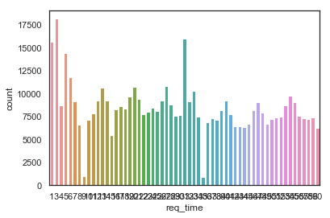
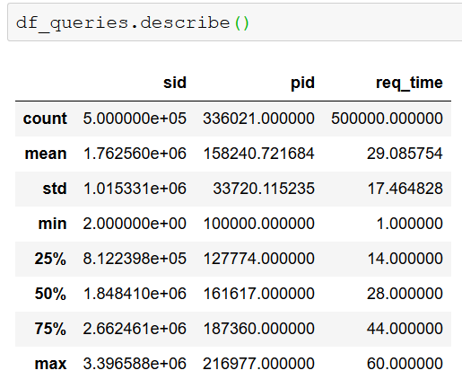
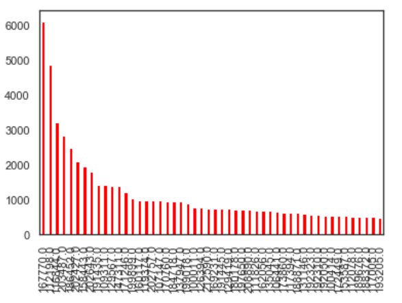
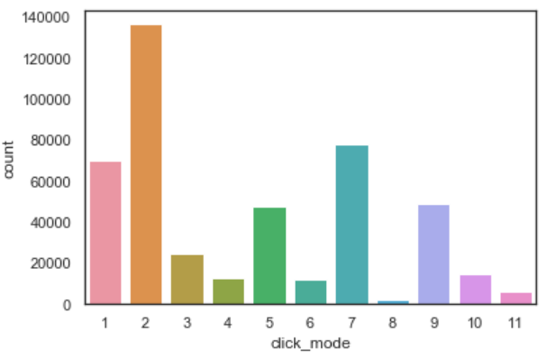

# Issue #4: understand data, EDA

### 1.1. Profiles DF

This dataframe is a one-hot encoding of the profiles of size `(63090, 67)`. Each profile has an encoding of an array of length 67. There are 63k profiles in total. No null values.

### 1.2. Queries DF

This dataframe shows the 500k queries made during the timeframe from 2018 October 1 at 00:00:10 until 2018 November 30 at 23:59:17. One possible visualization is to get the amount of queries per day:

- The date is in this format: `2018-10-20 17:08:12`
- Preprocessing: obtain the days
- Increment by 30 every month, so that the days range from [1-30\*num_months]
- With the input divided across 2 months, the dates range between 1 and 60.
- Visualize count of queries per day

#### Queries per day of the week



Queries per day of the week:

```python
[816, 907, 825, 695, 1224, 1129, 941]
```

Thursday is the least popular day with just 695 queries per day, and then there's a peak on Friday and Saturday. **People make more queries on the weekend.**

#### Statistics of `df_queries`

{width=400}

* 500k entries for all columns except for `pid`, there are 164k anonymous entries. The rest are done by 46k users (one user can make many queries).
* The average day is 29, approximately the middle of the array of time, at the end of the first month. The queries are more or less constant throughout the days.
* The coordinates are heavily centered in (116,39.9). They vary from (115-117) and (39.4,40.9)

#### User analysis

- There are 46k users in this dataframe (63k users in `profile_df`)
- Each user has made an average of 7 queries
- There's a high variance (54)
- The most popular users have 6000 entries, while many more have just one
- 75% of users in this df have done 5 or less queries

These are the number of queries of the most popular users:

{width=400}

### 1.3. Clicks DF

No null values. There are 453k rows, but 500k queries. Question: why less?

{width=400}

The classes are quite imbalanced, almost 140k entries for mode=2 and just 5k for mode=8. 

* Possible approaches:
    - Downsample mode=2 and probably 1 and 7
    - Upsample 4, 6, 8, 11? Dangerous

The F1-score should take into account all classes but there are 30x times more entries for mode=2 than for mode=8, mode=8 won't be classified that well.

### 1.4. Plans DF

No null values. There are 491k entries, but 500k queries. Question: why less? Some queries don't have plans?

TODO: how to process plans? new rows, new columns?

## Key findings

* Users
    - 63k profiles in `profiles_df`, out of which 46k make queries
    - 164k anonymous queries
    - 75% of users have done 5 or less queries
* Times
    - Queries done across 2 months, somewhat constant amount of queries per day
    - Least popular day of the week: Thursday
    - Most popular days of the week: Friday and Saturday
* Coordinates
    - Heavily centered in (116,39.9). They vary from (115-117) and (39.4,40.9)
* Clicks
    - 453k click entries but 500k queries. 47k queries aren't assigned a target value?
    - High target imbalance, almost 140k entries for mode=2 and just 5k for mode=8
    - Possible approaches:
        + Downsample mode=2 and probably 1 and 7
        + Upsample 4, 6, 8, 11? Dangerous
* Plans
    - 491k plan entries, but 500k queries. 9k queries aren't assigned a plan?
    - How to preprocess plans? Expand into columns or rows?
