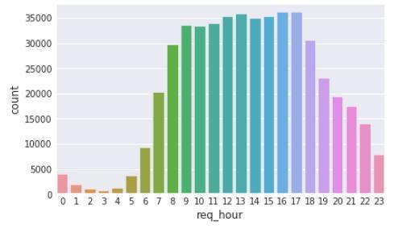
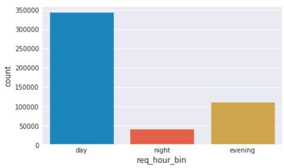

# Notes from public code

## Analysis

* There are some repeated trips (same origin and destination), but not much
* Not all queries have plans

## Time

* Divide time into weekdays, night/morning/afternoon/evening.
	* new column: weekday/weekend(fri + sat), binary
	* new column: time of day, need to visualize first

* Proposed solution: night [0-7]h, day: [8-17]h, evening: [17-23]h

* Explore relationship between req_time and plan_time
* req_time might not be peak time, but req_time + ETA might be
	* req_time + eta, and then feature engineering

## Geography

* Consider Beijing's urban setting, whether commercial, traffic, subway stations

## Feature engineering

* normalize values? price, distance, ETA

## NEW ADDED FEATURES

### add_time_features

There's a function in `../src/data/features/build_features.py` called `add_time_features()`, which for each column of type `datetime`, creates the following features:

* Month
* Day
* Hour
* Weekend: the queries are much higher in Friday and Saturday, this column is a binary column saying whether the day is Friday or Saturday, or not
* Night: a binary column specifying if the hour is a night hour, between 0:00 and 8:00
* Day: a binary column specifying if the hour is a day hour, between 8:00 and 18:00
* Evening: a binary column specifying if the hour is an evening hour, between 19:00 and 23:00

These 5 columns can be added to `req_time`, `plan_time` or `click_time`

### add_public_holiday

This function creates a new column `is_public_holiday`, stating if the date of the query is a public holiday or not. It's a binary column.