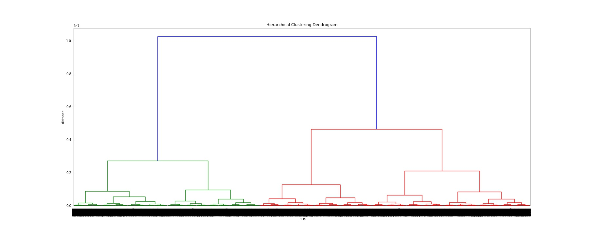

# Issue #110: Task 2 Clustering

## Centroid Model: k-Means

Aim is to partition n observations into k clusters in which each observation belongs to the cluster with the nearest mean, serving as a prototype of the cluster. 

### Sample Code

#### Euclidean Distance

```
from clustering import kmeans_clustering

df_profiles = pd.read_csv('../data/raw/profiles.csv')
df, cluster_array = kmeans_clustering(df_profiles, 4)
```

#### Hamming Distance aka k-Modes

Similar to k-Means: a number of clusters (k) is chosen, and k cluster-mode vectors are chosen at random. Library can be installed with `pip install kmodes` and works analogously to scikit-learn’s k-means construct. The k-modes algorithm tries to minimize the sum of within-cluster Hamming distance from the mode of that cluster, summed over all clusters. 

```
from clustering import kmodes_clustering

df_profiles = pd.read_csv('../data/raw/profiles.csv')
df, cluster_array = kmodes_clustering(df_profiles, 4, 3)
```

### Validation Silhouette Score

```
from clustering_validation import silhouette_score

df_profiles = pd.read_csv('../data/raw/profiles.csv')
df_std = StandardScaler().fit_transform(df_profiles)
km = KMeans(n_clusters=4)
km.fit(df_std)
labels = km.labels_

avg_score = silhouette_score(df_profiles, labels)
```

## Connectivity Model: Hierarchical Clustering

No need of knowledge about cluster number k in advance. Two types: (i) Agglomerative ("bottom-up") = each observation starts in its own cluster, and pairs of clusters are merged as one moves up the hierarchy (ii) Divisive ("top-down") = all observations start in one cluster, and splits are performed recursively as one moves down the hierarchy. We use the `linkage()`-function with `ward` as method and n_cluster needs to be passed in order to truncate the results. 

### Sample Code

```
from clustering import hierc_clustering

df_profiles = pd.read_csv('../data/raw/profiles.csv')
df, cluster_array = hierc_clustering(df_profiles, 8)
``` 

### Dendrogram

A dendrogram is saved automatically while running `hierc_clustering()` so that it simply can be viewed as follows:

```
img = mpimg.imread('data/task2/dendrogram.jpg')
imgplot = plt.imshow(img)
plt.show()
```


### Validation Cophenetic Correlation Coefficient

```
from clustering_validation import ccc_validation

df_profiles = pd.read_csv('../data/raw/profiles.csv')
cluster_matrix = linkage(df_profiles, 'ward')
c, coph_dists = ccc_validation(df_profiles, cluster_matrix)
```

## Density Model: OPTICS

Basic idea is similar to DBSCAN but OPTICS addresses one of DBSCAN's major weaknesses: detecting meaningful clusters in data of varying density by linearly ordering the points of the database such that spatially closest points become neighbors. 

### Sample Code

```
from clustering import optics_clustering

df_profiles = pd.read_csv('../data/raw/profiles.csv')
df, cluster_array = optics_clustering(df_profiles, 50, 0.05)
```
